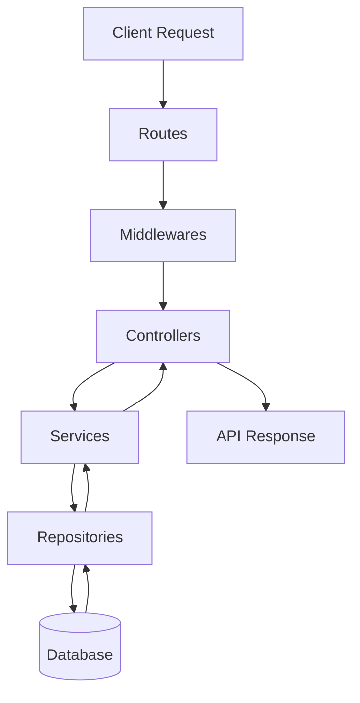

# Node.js Base Project Template

This is a **base Node.js project template** designed with key coding principles and project management recommendations in mind.  
It provides a solid foundation for building scalable, maintainable Node.js applications.  
Feel free to customize it according to your project requirements.

---

## 📁 Project Structure

All the main source code resides inside the `src/` folder.  
**Note:** Tests should be kept in a separate `tests/` directory for better organization.

```plaintext
src/
│
├── configs/ # Configuration files for libraries, modules, and environment setup
├── routes/ # Application routes and route registration
├── middlewares/ # Request interceptors for validation, authentication, etc.
├── controllers/ # Request handling and API response formatting
├── repositories/ # Database interaction layer
├── services/ # Business logic layer
└── utils/ # Helper functions, utilities, and custom error classes
```

---

## 📂 Folder Details

### **1. configs/**

This folder contains everything related to configuration or setup of libraries/modules.
Examples:

- **dotenv** setup for environment variables (`server-config.js`).
- Logger setup for generating meaningful logs.

---

### **2. routes/**

- Registers application routes.
- Connects routes with their corresponding **middlewares** and **controllers**.

---

### **3. middlewares/**

- Intercepts incoming requests before reaching the business logic.
- Common use cases:
  - Request validation
  - Authentication checks
- Executes **before** controllers to ensure only valid requests are processed.

---

### **4. controllers/**

- The **final middleware** before business logic.
- Responsibilities:
  1. Receive requests and extract required data.
  2. Pass data to the **services** layer.
  3. Receive processed data from services.
  4. Format and send the API response.

---

### **5. repositories/**

- Handles **all database operations**.
- Contains raw SQL or ORM queries.
- Is the **only layer** that interacts directly with the database.

---

### **6. services/**

- Contains **business logic**.
- Interacts with repositories to fetch or store data.
- Ensures controllers don’t directly handle data operations.

---

### **7. utils/**

- Stores reusable helper methods, constants, and custom error classes.

---

## 🛠 Customization

You can:

- Add a `tests/` folder for unit and integration tests.
- Integrate more configurations as per project needs.
- Expand folder structure for large-scale applications.

---

## 📌 Recommendation

- Maintain separation of concerns between **controllers**, **services**, and **repositories**.
- Keep configurations isolated in `configs/` for reusability.
- Use middlewares for validation and authentication to keep controllers clean.

---

## 🔄 Application Flow Diagram



---

## 🚀 Setup the Project

Follow these steps to set up the project on your local machine:

1. Download this template from GitHub and open it in your favorite text editor.

2. Go inside the project folder path and execute the following command:
   npm install

3. In the root directory, create a `.env` file and add the following environment variable:
   PORT=<port number of your choice>

4. Go inside the `src` folder and execute the following command:
   npx sequelize init

5. By executing the above command, you will get:
   - A `migrations` folder
   - A `seeders` folder
   - A `config` folder containing a `config.json` file

Your project is now set up and ready for development.

6. TO run the server:
   npm run dev
